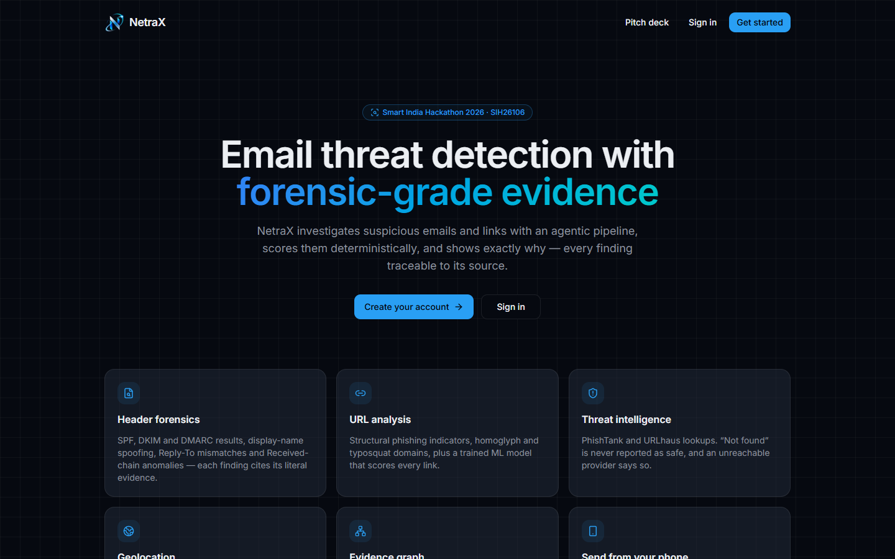
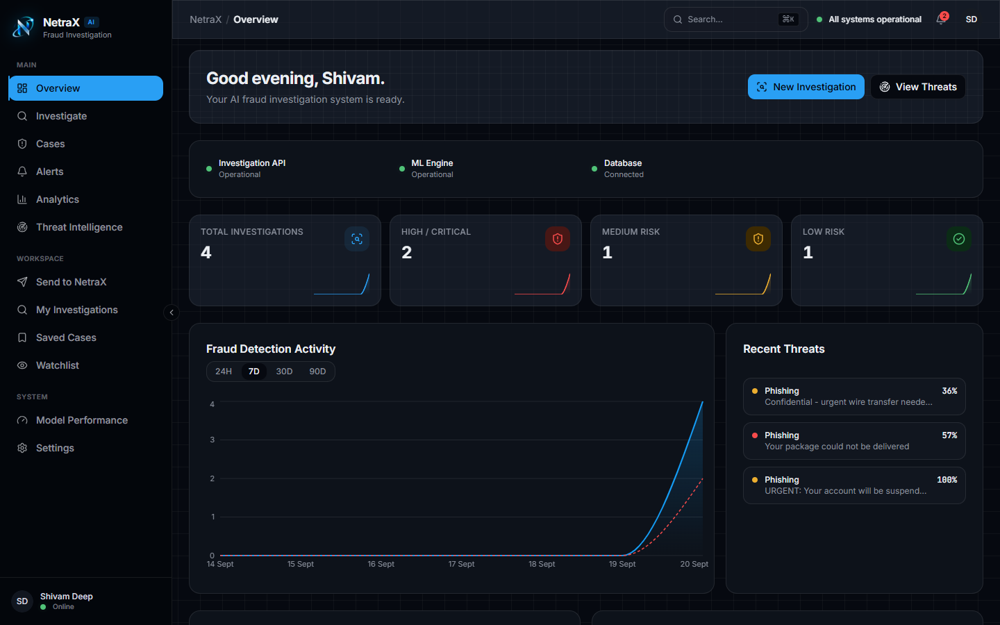
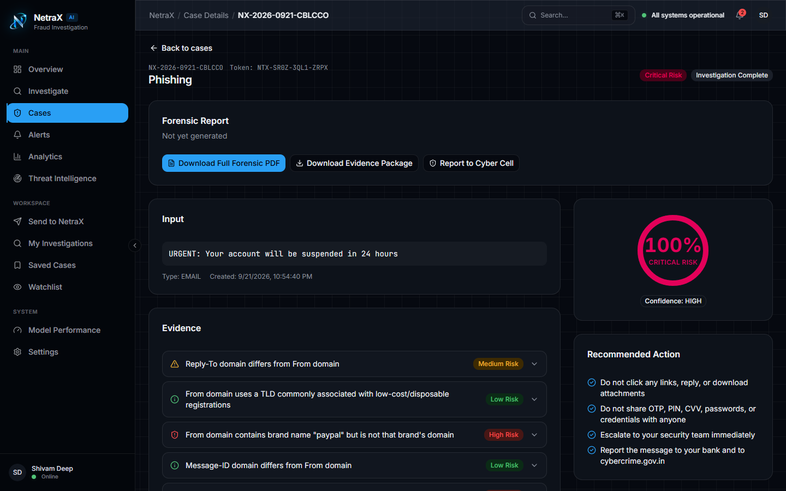
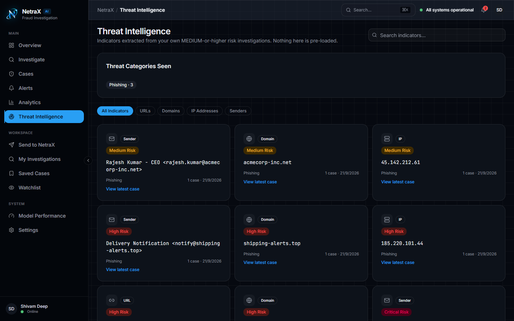
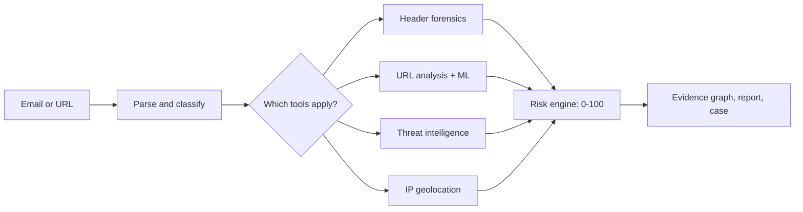
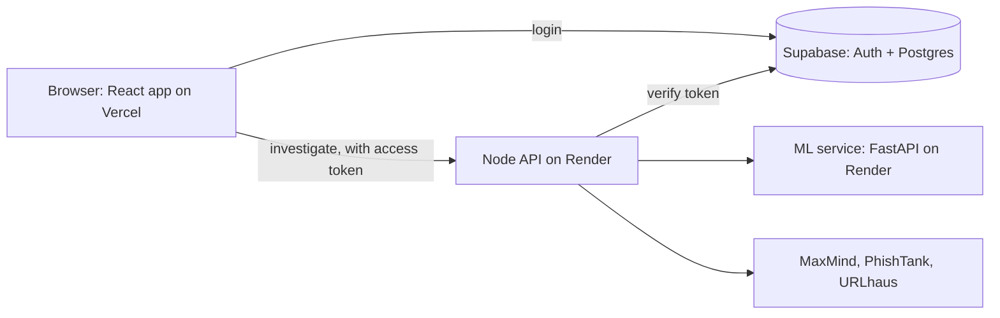

# NetraX

NetraX investigates suspicious emails and links. Paste or upload an email (or a URL) and it checks the headers, analyses the links, looks the indicators up in threat-intelligence feeds, geolocates the sending IP and runs a trained classifier on the text. The findings are combined into a 0-100 risk score, with the evidence behind every number, an evidence graph, and a forensic PDF you can download.

Built for Smart India Hackathon 2026, problem statement SIH26106 (AICTE Cyber Security Cell): *AI-Powered Email Threat Detection, GeoLocation and Forensic Intelligence Platform*.

**Live:** https://netra-x-chi.vercel.app

The backend runs on free hosting. If nobody has used it for a while, the first request can take up to a minute while the servers wake up.

<p align="center">
  
</p>

| Dashboard | Case detail |
| --- | --- |
|  |  |

| Threat intelligence, built from your own cases |
| --- |
|  |

## What it does

- **Investigate** a raw email (`.eml`, pasted text or JSON) or a single URL.
- **Header forensics**: SPF/DKIM/DMARC results, display-name spoofing, Reply-To and Return-Path mismatches, look-alike domains (homoglyph and typosquat checks), Received-chain and timestamp anomalies. Every finding quotes the header it came from. A header that is missing is reported as missing, not guessed.
- **URL analysis**: structural phishing signals (IP as hostname, `@` tricks, shorteners, odd TLDs, encoding) plus a trained model.
- **Threat intelligence**: PhishTank and URLhaus lookups. "Not found" is never shown as "safe", and if a provider is unreachable or has no key the result says so.
- **Geolocation**: MaxMind lookup of the sending IP, public addresses only (private and reserved ranges are filtered out), shown as an approximate location.
- **Risk score**: a fixed, documented formula, not a model's opinion. See [docs/RISK_SCORING.md](docs/RISK_SCORING.md).
- **Evidence graph**: email, sender, domain, URL, IP, ASN and country as a graph you can click through.
- **Reports**: forensic PDF, an evidence package (ZIP), and a demo complaint package for the Cyber Cell flow. The complaint package is a demo and is not a real submission.
- **Cases, alerts, watchlist, analytics**: every HIGH or CRITICAL case creates an alert, and every chart is computed from your own cases.
- **Send to NetraX**: paste or upload, open the page on a phone through a QR code, or share to it from Android (the share target needs HTTPS).
- **Gmail auto-detect**: connect your own Gmail (read-only) and new mail is investigated while the app is open.
- **Accounts**: email and password or Google sign-in. Each user only ever sees their own data.

## How an investigation runs



The orchestrator decides which tools are relevant and skips the rest, and each skip is logged. An email with no URL never touches the URL tools, and one with no public source IP never calls geolocation. The details are in [docs/investigation-flow.md](docs/investigation-flow.md) and [docs/AGENT_ARCHITECTURE.md](docs/AGENT_ARCHITECTURE.md).

## Architecture



- The frontend talks to Supabase directly for sign-in and for each user's cases and alerts (row-level security keeps users apart).
- The Node API does the investigations. It has no npm dependencies and runs TypeScript directly on Node 24.
- The ML service is a small FastAPI app that loads the trained models and answers `/analyze`.

## ML models

Trained with scikit-learn on public datasets. Numbers are from a held-out test split, single run, and come from [ml/models/model_metadata.json](ml/models/model_metadata.json). The write-ups are in [docs/ml](docs/ml).

| Model | Algorithm | Dataset | Precision | Recall | F1 | ROC-AUC |
| --- | --- | --- | --- | --- | --- | --- |
| Email content | Linear SVM | Apache SpamAssassin corpus | 0.961 | 0.961 | 0.961 | 0.998 |
| URL phishing | Histogram gradient boosting | UCI Phishing Websites | 0.960 | 0.949 | 0.954 | 0.993 |
| SMS spam | Linear SVM | UCI SMS Spam Collection | 0.967 | 0.908 | 0.937 | 0.990 |
| Transaction fraud | Random forest | Kaggle credit card fraud | 0.947 | 0.747 | 0.835 | 0.949 |

The app itself uses the email and URL models. The SMS and transaction models are trained and served but not part of the current flow. The URL model can only compute 7 of the dataset's 30 features from a URL string alone, so it is treated as one signal among several, not a verdict.

## Tech stack

| | |
| --- | --- |
| Frontend | React 19, TypeScript, Vite, Tailwind CSS 4, React Router, Recharts, Framer Motion |
| API | Node.js 24, no dependencies (built-in `http`) |
| ML service | Python 3.11, FastAPI, scikit-learn, XGBoost |
| Data and auth | Supabase (Postgres, Auth, row-level security) |
| External lookups | MaxMind, PhishTank, URLhaus, Gmail API |
| Hosting | Vercel (frontend), Render (API and ML, via Docker), Supabase |

## Running it locally

You need Node 24 or newer, Python 3.11, and a Supabase project.

**1. Database.** In the Supabase SQL editor, run the files in [supabase/migrations](supabase/migrations) in order (`20260919120000_user_workspace.sql`, then `20260920120000_gmail_connections.sql`). Under Authentication, enable the Email provider. For local testing it is easier to turn off "Confirm email".

**2. Environment.** Copy [.env.example](.env.example). The frontend reads `frontend/.env` (`VITE_SUPABASE_URL`, `VITE_SUPABASE_ANON_KEY`). The API reads `.env` in the repo root for the optional keys below. Everything else has a default.

**3. Start the three processes.**

```bash
# frontend  ->  http://localhost:5173
cd frontend
npm install
npm run dev

# investigation API  ->  http://localhost:8787   (from the repo root)
node server/local-api.ts

# ML service  ->  http://localhost:8000
cd ml
python -m venv .venv
.venv/Scripts/python -m pip install -r requirements-serve.txt     # Linux/macOS: .venv/bin/python
.venv/Scripts/python -m uvicorn api.server:app --port 8000
```

Open http://localhost:5173, create an account, and try **Investigate**. The `.eml` files in [data/demo](data/demo) make good test inputs (phishing, CEO fraud, a malware link, a legitimate email, and a few edge cases). If the ML service is not running, the investigation still works and simply has no ML evidence.

Training the models again needs `requirements-ml.txt` and the datasets; see [docs/DATA_SOURCES.md](docs/DATA_SOURCES.md) and `ml/train.py`.

## Configuration

| Variable | Where | What it does |
| --- | --- | --- |
| `VITE_SUPABASE_URL`, `VITE_SUPABASE_ANON_KEY` | frontend | Supabase project (the anon key is public by design) |
| `VITE_LOCAL_API_URL` | frontend | Address of the API. Defaults to `http://localhost:8787` |
| `MAXMIND_ACCOUNT_ID`, `MAXMIND_LICENSE_KEY` | API | IP geolocation. Without them the step reports "unavailable" |
| `PHISHTANK_APP_KEY`, `URLHAUS_AUTH_KEY` | API | Threat-intel lookups. Without them the step reports "unavailable" |
| `ML_API_URL`, `ML_API_KEY`, `ML_TIMEOUT_MS` | API | Where the ML service is, its shared key, and how long to wait for it |
| `GOOGLE_CLIENT_ID`, `GOOGLE_CLIENT_SECRET`, `GOOGLE_REDIRECT_URI` | API | Gmail auto-detect |
| `REQUIRE_AUTH`, `SUPABASE_URL`, `SUPABASE_ANON_KEY`, `ALLOWED_ORIGINS` | API | Production mode: require a Supabase login and restrict CORS |
| `GMAIL_TOKEN_KEY`, `FRONTEND_URL` | API | Encrypts stored Gmail tokens; where to send the user after Google consent |
| `RATE_LIMIT_PER_MIN` | API | Per-user request limit in production (default 60) |

[.env.example](.env.example) has the full list with comments.

## Deployment

- **Frontend** goes to Vercel with the root directory set to `frontend`, and `VITE_SUPABASE_URL`, `VITE_SUPABASE_ANON_KEY` and `VITE_LOCAL_API_URL` set.
- **API and ML service** are described in [render.yaml](render.yaml). Create a Render Blueprint from the repo and fill in the values marked as secrets. Both services build from the Dockerfiles in `server/` and `ml/`.
- **Database** is the Supabase project from the steps above. Add the deployed site to Authentication, URL Configuration.

With `REQUIRE_AUTH=true` the API refuses any request that does not carry a valid Supabase access token, limits CORS to `ALLOWED_ORIGINS`, and rate-limits per user.

## Security notes

- Every user's cases, alerts and Gmail connection sit behind row-level security, so one user cannot read or change another's rows.
- Gmail access tokens are stored encrypted (AES-256-GCM). The key exists only on the API server, so the database and the user's own browser only ever see ciphertext.
- The Google OAuth callback is tied to the user who started it with a one-time `state`, which is refused if reused, expired or forged.
- The ML service can require an API key, and the API only reaches it server to server.
- More in [docs/SECURITY.md](docs/SECURITY.md).

## Tests

```bash
node --test "supabase/functions/_shared/**/*.test.ts" "server/*.test.ts"   # 193 tests
cd frontend && npm test                                                     # 37 tests
cd ml && .venv/Scripts/python -m pytest                                     # 34 tests
```

The Node tests cover the parsers, header forensics, URL analysis, risk engine, evidence graph, geolocation filtering, the API's auth, CORS and rate limiting, and the Gmail connection (against a fake Google server).

## Repository layout

```
frontend/                React app
server/                  Node API: routes, auth/CORS/rate limiting, Gmail connection
supabase/
  functions/_shared/     the investigation logic (parser, forensics, URL analysis,
                         threat intel, geolocation, risk engine, evidence graph)
  migrations/            database schema and row-level security
ml/                      training code, trained models, FastAPI inference service
data/                    dataset scripts and the sample emails in data/demo
docs/                    design notes, scoring, security, ML reports
render.yaml              Render Blueprint (API and ML)
```

The shared investigation code has no Deno-specific parts. It runs unchanged under Node, which is how the API and the tests use it. `supabase/functions/*/index.ts` are thin Deno wrappers around it that are not deployed; the running API is `server/local-api.ts`.

## Limitations

- PhishTank and URLhaus need API keys. They are not configured on the live deployment, so on the live site those two lookups report "unavailable".
- Gmail auto-detect uses a restricted Google scope. While the Google app is in testing mode only the Gmail addresses added as test users can connect.
- The Android share target needs HTTPS. There is no iOS share extension.
- The URL model works from a partial feature set (see above), and the transaction model has a recall of 0.75.
- This is a prototype. It does not replace official cybercrime reporting (cybercrime.gov.in) or a security team.

## More documentation

[investigation-flow.md](docs/investigation-flow.md), [AGENT_ARCHITECTURE.md](docs/AGENT_ARCHITECTURE.md), [RISK_SCORING.md](docs/RISK_SCORING.md), [DATA_SOURCES.md](docs/DATA_SOURCES.md), [SECURITY.md](docs/SECURITY.md), [LIMITATIONS.md](docs/LIMITATIONS.md), [mobile-ingestion.md](docs/mobile-ingestion.md). The pitch deck is built into the app at `/pitch`.

## Author

Shivam Deep, [github.com/shivam-24-deep](https://github.com/shivam-24-deep)
